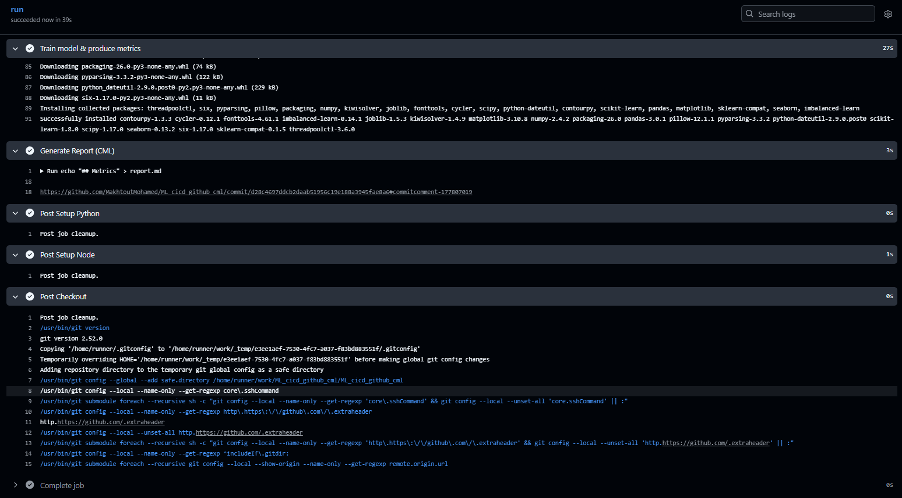
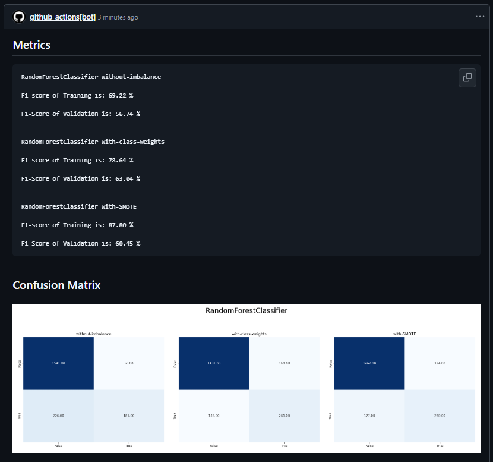

# Atelier 3 - CI/CD pour le Machine Learning (GitHub Actions + CML)

Ce dépôt met en place une **boucle MLOps simple** :

**push → entraînement → métriques + matrice de confusion → commentaire GitHub via CML**

Le workflow exécute `script.py` à chaque `git push`, génère :
- `metrics.txt`
- `conf_matrix.png`





Puis publie un **rapport Markdown** en commentaire grâce à **CML**.

## Structure

```
churn-cml/
├─ dataset.csv
├─ script.py
├─ requirements.txt
└─ .github/
   └─ workflows/
      └─ cml-churn.yaml
```

## Exécution locale

```bash
python -m venv .venv
source .venv/bin/activate
pip install -r requirements.txt
python script.py
```

Vous devez obtenir :
- `metrics.txt`
- `conf_matrix.png`

## CI/CD (GitHub Actions)

Le pipeline est dans : `.github/workflows/cml-churn.yaml`

Étapes principales :
1. Checkout du repo
2. Setup Python 3.11
3. Installation des dépendances (`requirements.txt`)
4. Exécution de `script.py` (génère `metrics.txt` + `conf_matrix.png`)
5. Génération de `report.md`
6. Publication du commentaire via `cml comment create`

> Le token utilisé est **`${{ secrets.GITHUB_TOKEN }}`** (fourni automatiquement par GitHub Actions).
> Il faut des permissions en écriture pour poster le commentaire (on utilise `permissions: write-all`).

## Résultat attendu

Après un `push`, dans l'onglet Actions / Commit (ou PR si vous travaillez via PR) :
- un commentaire contenant les métriques,
- l'image `conf_matrix.png` affichée dans le commentaire.
